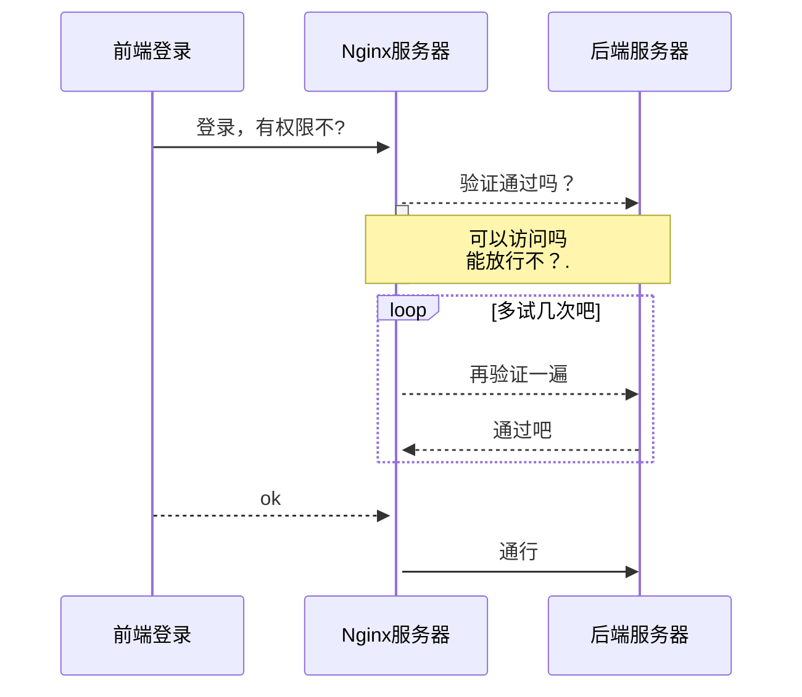

微信对接教务系统
===========

本系统基于thinkphp3.1.2

使用微信后台对接:indexAction.class.php
文件

有疑问可以直接发邮件到chrisdowson@qq.com。我会尽快回复的

```mermaid
	    sequenceDiagram
	    participant 登录 as 前端登录
	    participant Nginx as Nginx服务器
	    participant 后端服务 as  后端服务器   
	    登录 ->> +Nginx: 登录，有权限不?
	    Nginx-->> 后端服务: 验证通过吗？
	    activate Nginx
	    
	    Note over Nginx,后端服务: 可以访问吗<br/>能放行不？.
	    deactivate Nginx
	    loop 多试几次吧
	    Nginx-->>后端服务: 再验证一遍
	    后端服务-->>Nginx: 通过吧
	    end
	    登录-->>Nginx: ok
	    Nginx->>后端服务: 通行
```
